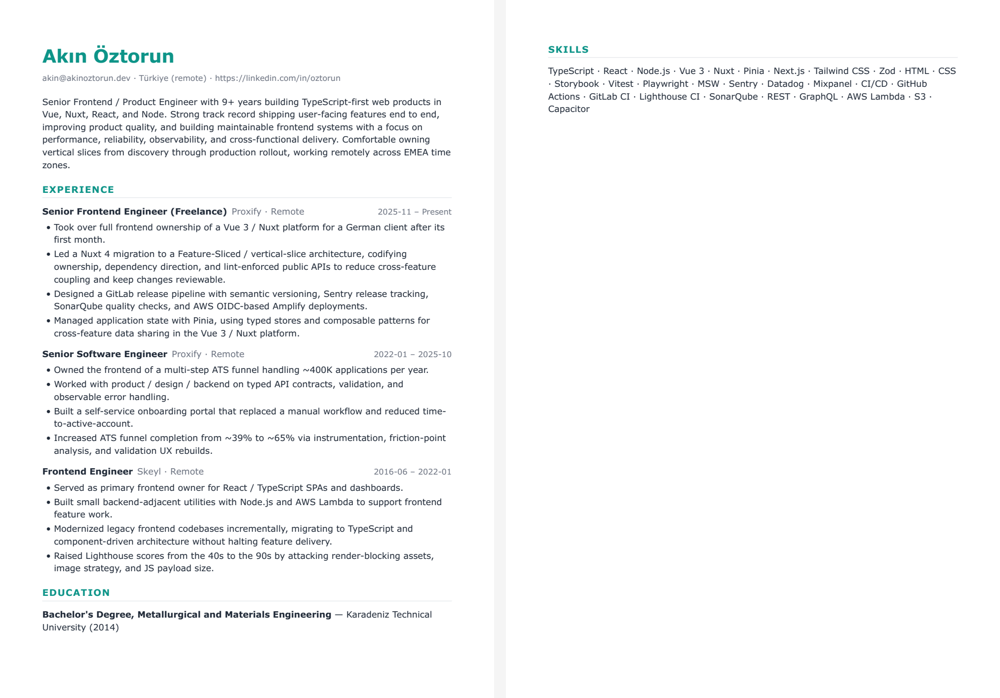

# Worked example

The same inputs the maintainer (Akın) uses against his own applications —
real bullets from his [`job-hunt`](https://github.com/akin-oz/job-hunt) truth
source ([`sample-resume.json`](sample-resume.json)) tailored against a real
cached JD he applied to ([`sample-jd.txt`](sample-jd.txt) — **Lette, Senior
Product Engineer**, score 120 in the tracker, sourced from
`job-hunt-local/state/job-descriptions/`).

The **actual outputs** the pipeline produces ([`tailored.json`](tailored.json),
[`tailored.pdf`](tailored.pdf)) are committed too, so you can see the result
without running anything.



(`tailored.preview.png` is a 2-up rasterization of `tailored.pdf` so GitHub
can render it inline. Regenerate after the PDF changes — see the bottom of
this file.)

Use this to:

- See the **shape** the API expects without reading Pydantic.
- Demo the bullet-pool method in 30 seconds against the live deploy or local
  `make dev`.
- Sanity-check changes: a regression in tailoring will visibly change
  `tailored.json`, and the diff lands here.

## What the stub picked, and why it matters

The JD asks for "TypeScript / JavaScript, React (or similar), Node.js",
8+ years in fast-paced startups, generalist mindset, and product-mindedness
across full-stack feature ownership. Look at `tailored.json`:

- **Skills reordered:** `TypeScript, React, Node.js, Vue 3, Nuxt, Pinia, …` —
  the three skills the JD names explicitly are now first, ahead of the
  Vue/Nuxt stack that's the maintainer's *current* day-to-day. The pool
  isn't lying about what he uses now; it's surfacing what *this* JD weights.
- **Skeyl (React role) hoisted `s-react-spa-owner` first, then
  `s-node-lambda-utilities`.** That's the exact pair a Lette reader needs to
  see: React/TypeScript ownership on SPAs *plus* Node.js backend-adjacent
  work, demonstrating the generalist mindset the JD calls out.
- **Proxify Senior** surfaced the ATS funnel ownership (~400K applications /
  year), the funnel-completion lift (39% → 65%), the typed-API-contract
  collaboration with backend, and the self-service onboarding portal — every
  one a product-engineer-on-conversion-flows signal that maps to "own
  features end to end" and "product-mindedness" in the JD.
- **Proxify freelance** led with Vue ownership, the Nuxt 4 / Feature-Sliced
  migration, the GitLab release pipeline, and Pinia state management. The
  release-engineering bullet rose because the JD emphasises "ship value
  daily via feature flags" and AWS infrastructure.
- **Bullets *not* picked:** Capacitor mobile, Mixpanel/Sentry observability,
  Tailwind adoption, the design-system layer, the Quality Award, Lighthouse
  CI gates. All real, all true, all less load-bearing for *this* JD —
  rerun against a mobile-shop or a design-system-platform role and the
  picks shift accordingly. That's the method working, not a bug.
- **What the model is *not* allowed to do:** the JD asks for "AI-native
  thinking", "prompt chaining", "vector databases", "LangChain". The
  maintainer has none of these in his bullet pool. An unconstrained LLM
  would happily invent some. The bullet-pool contract refuses: the only
  bullets that can appear in the output are the ones the user wrote, IDs
  validated server-side. The absence of fake AI experience in
  `tailored.json` is the contract enforcing itself.

The `keywordsInjected` field reports which JD vocabulary survived into the
chosen bullets — `["typescript", "architecture", "aws", "scale", "product",
"react", "node.js", "backend"]` — useful for sanity-checking that the JD
actually moved the needle.

The detected archetype is `fullstack`, which matches what Lette is
actually hiring for: a "Senior Product Engineer" who works across the
stack. (Earlier versions of the heuristic mis-classified this JD as
`backend` on raw Node/Postgres keyword count; explicit cross-stack
phrases — "across the stack", "generalist", "product engineer", "jump
between" — now factor in alongside individual tech keywords.)

## Reproduce against the live API

```bash
# 1. Tailor (stub mode — no key, deterministic, ~50ms).
curl -sS https://resume-tailor-api-6vbv.onrender.com/api/tailor \
  -H 'content-type: application/json' \
  -d "$(jq -n \
        --slurpfile r examples/sample-resume.json \
        --rawfile  jd examples/sample-jd.txt \
        '{resume: $r[0], jd: {text: $jd}}')" \
  | tee examples/tailored.json | jq

# 2. Render the tailored result to PDF.
curl -sS https://resume-tailor-api-6vbv.onrender.com/api/render \
  -H 'content-type: application/json' \
  -d "$(jq -n \
        --slurpfile r examples/sample-resume.json \
        --slurpfile t examples/tailored.json \
        '{resume: $r[0], tailored: $t[0], templateId: "modern", format: "pdf"}')" \
  > examples/tailored.pdf
```

(Free-tier backend cold-starts in ~30s after idle; warm requests are fast.)

## Try it locally

```bash
make dev   # api on :8000, web on :5173
# In the UI: click "Load sample" — same JSON ships as the seed in web/src/sampleResume.ts.
```

## What to look for

The bullet-pool contract is observable in the response:

- Every `storyIds` entry in `experiences[]` is an ID from `sample-resume.json`.
  The model never invents a bullet.
- `droppedStoryIds` is empty in stub mode. Under AI mode, any ID the model
  hallucinated would land here and be dropped from the output (not silently
  rendered).
- `profileFallbackUsed: true` means the model's profile failed validation
  (banned phrases, em-dashes, or word-count window) and we substituted a
  clean truncation of `profileSeed`. Better a boring true sentence than a
  flashy false one.
- `keywordsInjected` lists the JD vocabulary that survived into the chosen
  bullets. Useful for sanity-checking that the JD actually moved the needle.

## Why this example over a minimal one

A 1-experience, 3-bullet sample (like the one in `web/src/sampleResume.ts`) is
the right thing to load on first page-paint — it teaches the form. It is the
*wrong* thing to demo the method against, because there's nothing to *select
from*: every bullet is going in. The point of the bullet pool is that 18+
bullets become 8–10, and which ones change with the JD. This example makes
that visible.

## Regenerating after edits

If you change `sample-resume.json`, `sample-jd.txt`, or the templates,
regenerate the committed outputs so the README stays accurate:

```bash
make eval-example   # regenerates tailored.json + tailored.pdf + tailored.preview.png
```
